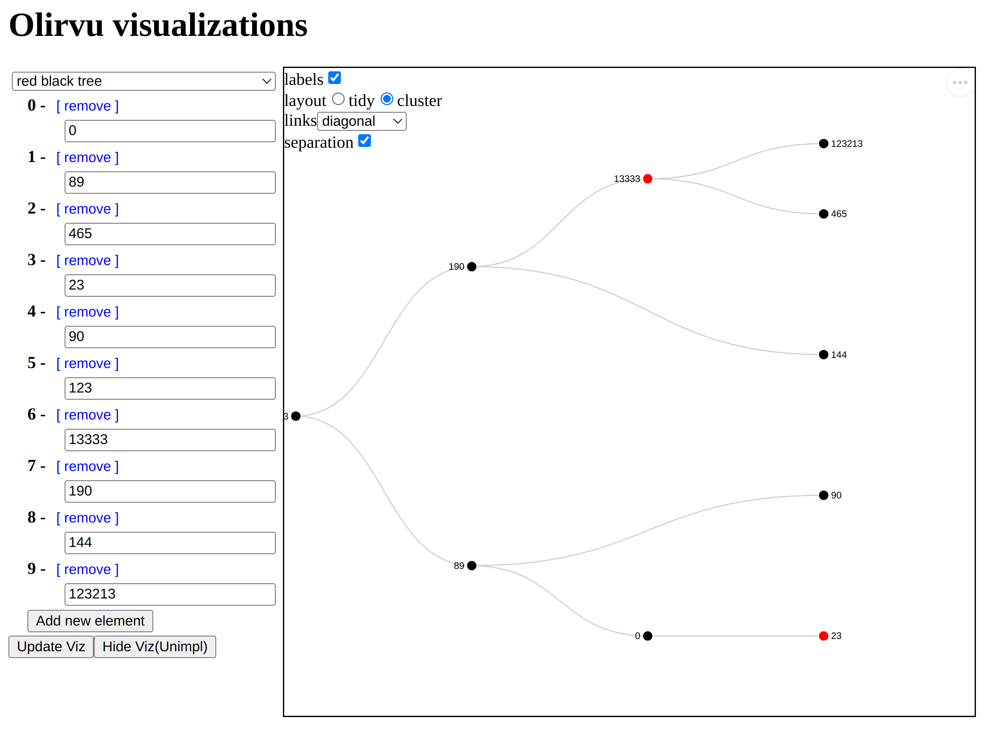
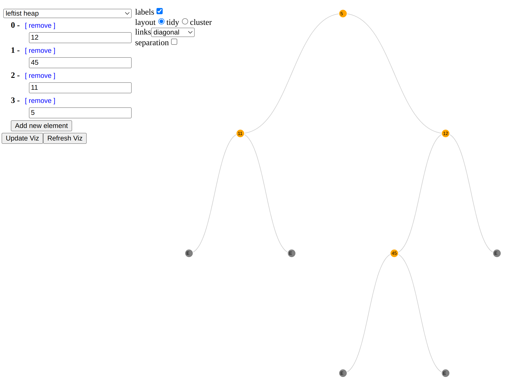
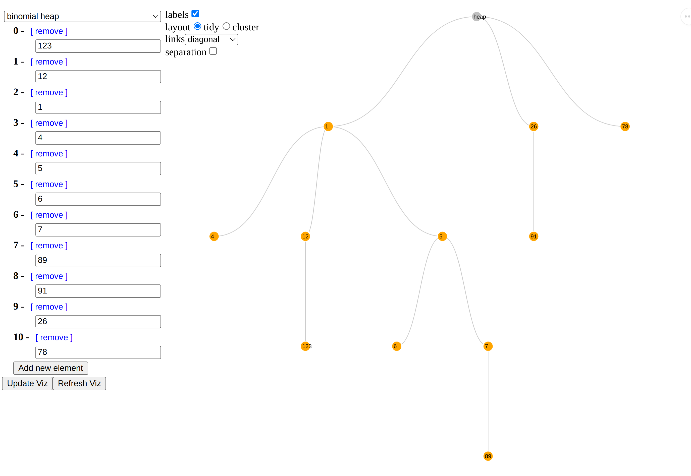
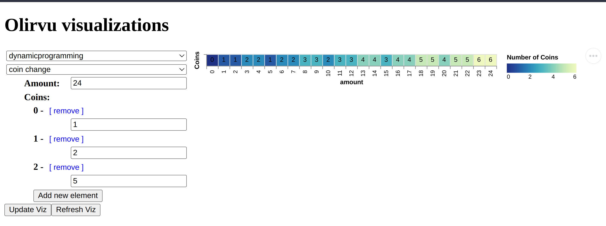
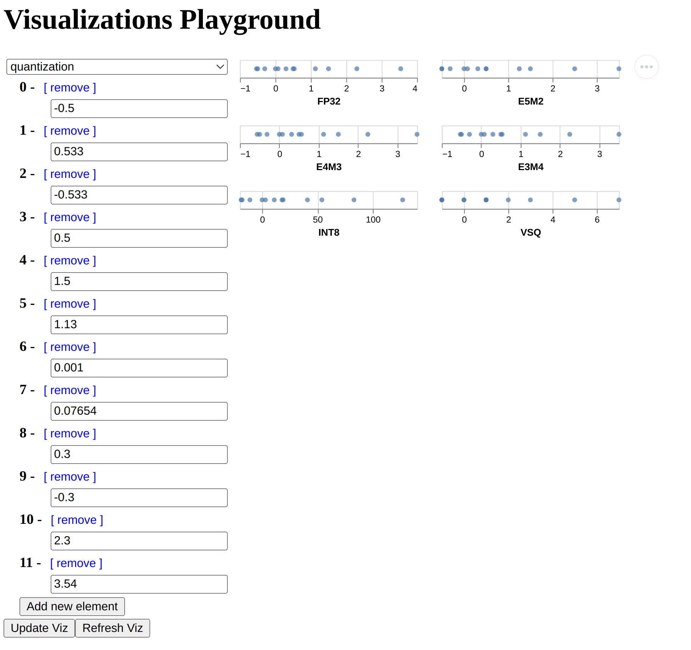

# Table of Contents

1.  [Oḷirvu](#org5e37f71)
    1.  [To run the app](#orgdc66ecc)
    2.  [Visualizations](#orgd14b49b)
        1.  [Heaps](#org8bdc296)
        2.  [Dynamic Programming](#org077cba5)
        3.  [Quantization](#org8fc4ddb)
    3.  [Known Issues](#org2873036)

# Oḷirvu

## To run the app

    make run

## Visualizations

### Heaps

1.  Red Black Tree

    

2.  Leftist Heap

    

3.  Binomial Heap

    

### Dynamic Programming

1.  Coin change

    

### Quantization

## Known Issues

1.  If the Tree is not rendered with a default tree, the
    layout hides the label of the root node. So, we always start the
    visualization with some defaults
2.  Binomial heap viz - The children of heap are not displayed in
    increasing order of rank.
3.  Binomial heap viz - Multiple roots problem was avoided by
    introducing a root node called "heap"

